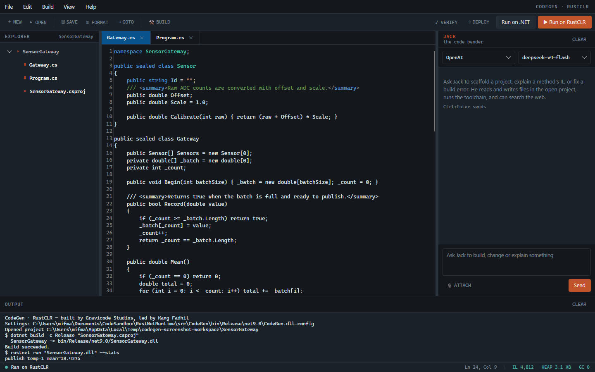
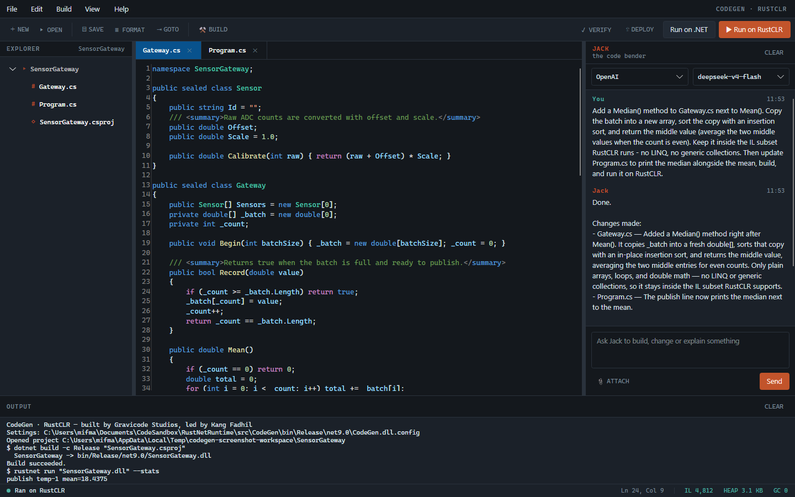
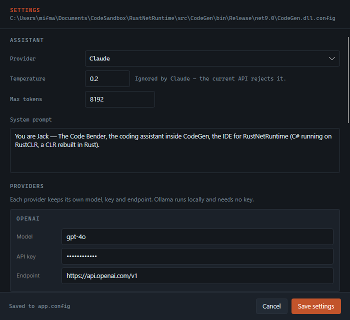
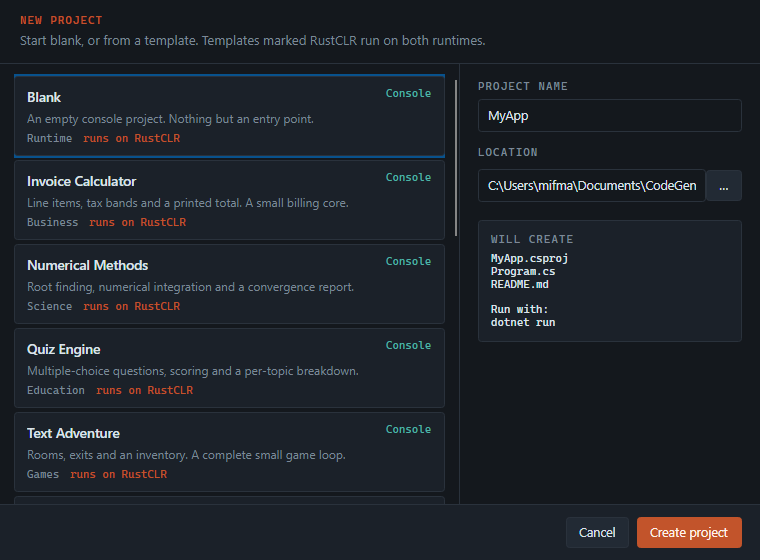

# CodeGen

*[English →](../codegen.md)*

IDE untuk RustNetRuntime, beserta asistennya — Jack, The Code Bender.

---

## Ruang kerja



**Explorer** (kiri) menampilkan proyek yang terbuka. Folder `bin`, `obj`,
`.git`, `target`, dan folder bertitik disembunyikan — semuanya tidak pernah jadi
hal yang ingin Anda sunting. Klik ganda sebuah berkas untuk membukanya.

**Editor** (tengah) adalah AvaloniaEdit dengan pewarnaan sintaks TextMate, nomor
baris yang bisa dimatikan (**View → Line Numbers**), dan satu tab per berkas.
Titik setelah nama berkas berarti ada perubahan yang belum disimpan.

**Chat** (kanan) adalah Jack. Ubah lebarnya dengan menyeret pembatas, atau
sembunyikan dengan `Ctrl+J`.

**Output** (bawah) memuat keluaran build dan run saat itu juga, bukan setelah
perintah selesai.

**Status bar** menampilkan keadaan, posisi kursor, dan bacaan runtime:

```
IL 4.812   HEAP 3,1 KB   GC 0
```

Itu penghitung sungguhan, dibaca dari `rustnet run --stats` terakhir. IDE yang
subjeknya adalah sebuah runtime memang sepatutnya menampilkan angka runtime itu
sendiri.

---

## Bekerja dengan Jack



Jack punya alat. Ia tidak menjawab dari ingatan lalu menyuruh Anda mengetik — ia
membaca dan menulis berkas yang ada di depan Anda.

### Yang bisa ia lakukan

**Di dalam proyek**

| Alat | |
| --- | --- |
| `list_files` | Melihat isi proyek |
| `read_file` | Membaca berkas, lengkap dengan nomor baris |
| `write_file` | Membuat berkas, atau menimpanya seluruhnya |
| `edit_file` | Mengganti satu blok persis — pilihan utama untuk perubahan kecil |
| `delete_file` | Menghapus berkas |
| `search_project` | Mencari berkas yang memuat suatu teks |
| `create_project` | Membuat kerangka dari template |
| `list_templates` | Melihat katalog template |

**Toolchain**

| Alat | |
| --- | --- |
| `build` | Kompilasi dengan .NET SDK |
| `run` | Build lalu jalankan, di .NET atau RustCLR |
| `verify_on_rustclr` | Laporkan apa yang tidak bisa di-resolve RustCLR |
| `deploy` | Publish self-contained untuk suatu runtime identifier |
| `disassemble` | Tampilkan IL sebuah method |
| `run_command` | Selebihnya (bisa dimatikan di Settings) |

**Di luar**

| Alat | |
| --- | --- |
| `search_internet` | Pencarian web lewat Tavily |
| `scrape_web_page` | Ambil halaman sebagai teks yang terbaca |
| `math_calculation` | Aritmatika, dihitung bukan ditebak |
| `current_date_time` | Jam |
| `date_difference` | Selisih dua tanggal |

Setiap path yang disentuh Jack di-resolve di dalam proyek yang terbuka dan
ditolak kalau keluar dari sana. Ia menentukan *apa* yang diubah, bukan *di mana*.

### Cara meminta yang baik

Jack bekerja paling baik dengan tujuan dan batasan:

> Tambahkan rolling median ke gateway. Tetap di dalam subset IL yang dijalankan
> RustCLR — jangan pakai LINQ — lalu jalankan di RustCLR dan tunjukkan
> keluarannya.

Ia akan membaca berkasnya, menyunting, build, run, lalu memberi tahu berkas mana
saja yang ia sentuh. Baris di bawah balasannya mencantumkan alat yang
benar-benar ia panggil, jadi Anda bisa melihat apa yang terjadi alih-alih
memercayai ringkasan.

`Ctrl+Enter` mengirim. **CLEAR** memulai thread baru — berguna saat berganti
tugas, karena seluruh percakapan adalah konteks.

### Lampiran

**📎 ATTACH** menambahkan path gambar ke pesan berikutnya. Jack menerimanya
sebagai path, bukan bitmap yang disisipkan: alat-alatnya membaca dari disk, jadi
path lebih berguna dan jauh lebih hemat token.

---

## Penyedia LLM



Empat penyedia, dipilih di bagian atas panel chat:

| | |
| --- | --- |
| **Claude** | Lewat SDK resmi Anthropic, dibungkus sebagai layanan Semantic Kernel |
| **OpenAI** | Konektor OpenAI milik Semantic Kernel |
| **Gemini** | Konektor yang sama, diarahkan ke endpoint Google yang kompatibel OpenAI |
| **Ollama** | Konektor yang sama lagi, diarahkan ke server lokal Anda. Tanpa key |

Tiga dari empat berbicara protokol OpenAI, sehingga berbagi satu jalur kode.
Anthropic punya protokol sendiri, jadi `AnthropicChatCompletionService`
menjembataninya — mengubah riwayat chat dan kernel function Semantic Kernel
menjadi pesan dan tool Anthropic, lalu menjalankan loop tool-nya. Di atas kelas
itu, keempatnya tampak identik — itulah sebabnya alat-alatnya bekerja sama
persis apa pun pilihan Anda.

**Satu perbedaan yang perlu diketahui:** pengaturan *temperature* tidak berlaku
untuk Claude. API Anthropic saat ini menolak parameter sampling pada model
terbaru, jadi CodeGen tidak mengirimkannya. Dialog Settings menyatakan hal itu di
sebelah kolomnya, alih-alih membiarkan Anda mengisi nilai yang diam-diam
dibuang.

---

## Konfigurasi

Semuanya ada di `app.config`, yang disalin build menjadi `CodeGen.dll.config` di
sebelah executable. Salinan itulah yang dibaca dan ditulis aplikasi. Dialog
Settings menampilkan path lengkapnya di bagian atas.

Tidak ada penyimpanan kedua — tidak ada registry, tidak ada JSON tersembunyi di
AppData. Sunting berkasnya atau sunting dialognya; keduanya hal yang sama.

Isinya: penyedia aktif, temperature, max token, system prompt; model, key, dan
endpoint per penyedia; key Tavily; izin menjalankan perintah shell dan ukuran
berkas maksimum yang boleh dibaca Jack; path toolchain; font editor, ukuran,
lebar tab, nomor baris dan pembungkusan baris; lebar serta tampil-sembunyi
panel; dan proyek terakhir, supaya ruang kerja kembali seperti saat ditinggal.

---

## Proyek baru



**Blank** memberi proyek console dan satu entry point. **From Template** memberi
salah satu dari empat belas, mencakup console, web, desktop, mobile, IoT, dan
library, lintas bidang bisnis, sains, edukasi, dan game.

Panel kanan memperlihatkan persis berkas apa yang akan ditulis dan cara
menjalankan hasilnya. Template bertanda *runs on RustCLR* ditulis agar tetap di
dalam subset IL yang dieksekusi runtime saat ini — perulangan eksplisit
menggantikan LINQ, array menggantikan koleksi generic.

Katalog lengkap: [templates.md](../templates.md).

---

## Build, run, verify, deploy

| | |
| --- | --- |
| **Build** (`Ctrl+B`) | `dotnet build -c Release` |
| **Run on .NET** (`F5`) | Build, lalu jalankan di runtime rujukan |
| **Run on RustCLR** (`Ctrl+F5`) | Build, lalu jalankan di RustCLR dengan `--stats` |
| **Verify on RustCLR** | Laporkan anggota yang tidak bisa di-resolve RustCLR |
| **Deploy** | Publish self-contained untuk runtime identifier mesin ini |

Meletakkan dua tombol run berdampingan memang disengaja: assembly yang sama, dua
runtime, terpaut satu tombol. Ketika keduanya berbeda, Anda menemukan bug
runtime — dan `verify` biasanya sudah memberi tahu alasannya sebelum Anda
menjalankannya.

Kompilasi selalu lewat .NET SDK. RustCLR mengonsumsi IL; ia tidak mengompilasi
C#.

---

## Format kode

**Format Code** (`Ctrl+K`) adalah perapi indentasi berbasis kedalaman kurung
kurawal, bukan parser C#. Ia membetulkan indentasi dan spasi di ujung baris,
selebihnya dibiarkan. Lebih dari itu memerlukan Roslyn, dan menulis ulang kode
secara diam-diam lebih buruk daripada tidak merapikannya.

---

## Membuat ulang screenshot

Gambar-gambar di dokumentasi ini dirender dari jendela aslinya, tanpa layar:

```bash
dotnet run --project src/CodeGen -c Release -- --screenshot docs/images
```

Screenshot yang tidak bisa dibuat ulang akan basi begitu tata letaknya berubah.
Yang ini tidak.
