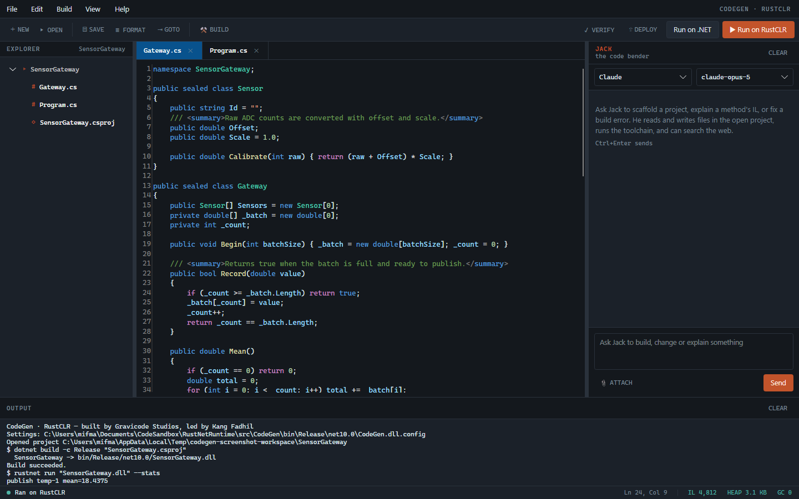
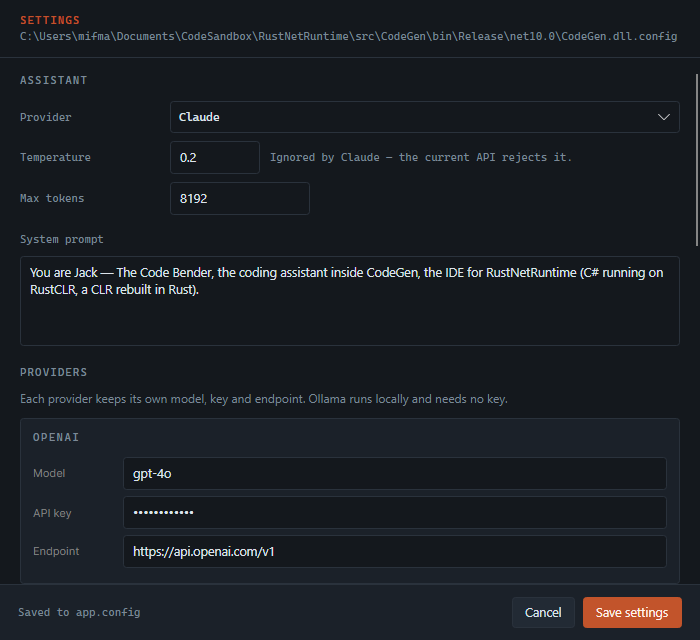

# CodeGen

*[Bahasa Indonesia →](id/codegen.md)*

The IDE for RustNetRuntime, and its assistant — Jack, The Code Bender.

---

## The workspace



**Explorer** (left) shows the open project. `bin`, `obj`, `.git`, `target` and
dotfolders are hidden — they are never what you want to edit. Double-click a
file to open it.

**Editor** (centre) is AvaloniaEdit with TextMate highlighting, line numbers you
can toggle (**View → Line Numbers**), and one tab per open file. A dot after the
filename means unsaved changes.

**Chat** (right) is Jack. Resize it by dragging the divider, hide it with
`Ctrl+J`.

**Output** (bottom) carries build and run output as it arrives, not after the
command finishes.

**Status bar** shows state, caret position, and the runtime readout:

```
IL 4,812   HEAP 3.1 KB   GC 0
```

Those are real counters, parsed from the last `rustnet run --stats`. An IDE
whose subject is a runtime should show the runtime's own numbers.

---

## Working with Jack


Jack has tools. He is not answering from memory and asking you to type — he
reads and writes the files in front of you.

### What he can do

**In the project**

| Tool | |
| --- | --- |
| `list_files` | See what exists |
| `read_file` | Read a file, with line numbers |
| `write_file` | Create a file, or replace one entirely |
| `edit_file` | Replace one exact block — preferred for small changes |
| `delete_file` | Remove a file |
| `search_project` | Find which files contain a string |
| `create_project` | Scaffold from a template |
| `list_templates` | See the template catalogue |

**The toolchain**

| Tool | |
| --- | --- |
| `build` | Compile with the .NET SDK |
| `run` | Build and run, on .NET or RustCLR |
| `verify_on_rustclr` | Report what RustCLR cannot resolve |
| `deploy` | Publish self-contained for a runtime identifier |
| `disassemble` | Show a method's IL |
| `run_command` | Anything else (can be switched off in Settings) |

**Outside**

| Tool | |
| --- | --- |
| `search_internet` | Web search via Tavily |
| `scrape_web_page` | Fetch a page as readable text |
| `math_calculation` | Arithmetic, evaluated rather than guessed |
| `current_date_time` | The clock |
| `date_difference` | Time between two dates |

Every path Jack touches is resolved inside the open project and refused if it
escapes. He decides *what* to change; he does not decide *where*.

### Asking well

Jack works best with a goal and a constraint:

> Add a rolling median to the gateway. Keep it inside the IL subset RustCLR
> runs — no async — then run it on RustCLR and show me the output.

He will read the file, edit it, build, run, and tell you which files he touched.
The line under his reply lists the tools he actually called, so you can see what
happened rather than trusting a summary.

`Ctrl+Enter` sends. **CLEAR** starts a fresh thread — useful when switching
tasks, since the whole conversation is context.

### Attachments

**📎 ATTACH** adds image paths to the next message. Jack receives them as paths,
not inlined bitmaps: his tools read from disk, so a path is more useful and
costs far fewer tokens.

---

## Providers



Four providers, chosen at the top of the chat panel:

| | |
| --- | --- |
| **Claude** | Through the official Anthropic SDK, wrapped as a Semantic Kernel service |
| **OpenAI** | Semantic Kernel's OpenAI connector |
| **Gemini** | The same connector, pointed at Google's OpenAI-compatible endpoint |
| **Ollama** | The same connector again, pointed at your local server. No key needed |

Three of the four speak the OpenAI protocol, so they share one code path.
Anthropic speaks its own, so `AnthropicChatCompletionService` bridges it —
converting Semantic Kernel's chat history and kernel functions into Anthropic
messages and tools, and running the tool loop. Above that class all four look
identical, which is why the tools work the same whichever you pick.

**One difference worth knowing:** the *temperature* setting does not apply to
Claude. The current Anthropic API rejects sampling parameters on recent models,
so CodeGen does not send it. The Settings dialog says so next to the field
rather than letting you set a value that is silently dropped.

---

## Configuration

Everything lives in `app.config`, which the build copies to
`CodeGen.dll.config` next to the executable. That copy is what the app reads and
writes. The Settings dialog shows its full path at the top.

There is no second store — no registry keys, no hidden JSON in AppData. Edit the
file or edit the dialog; they are the same thing.

What is in it: active provider, temperature, max tokens, system prompt; per
provider model, key and endpoint; the Tavily key; whether shell commands are
allowed and the maximum file size Jack may read; toolchain paths; editor font,
size, tab width, line numbers and wrapping; panel widths and visibility; and the
last open project, so the workspace comes back as you left it.

---

## New projects


**Blank** gives a console project and an entry point. **From Template** gives
one of fourteen, spanning console, web, desktop, mobile, IoT and library work
across business, science, education and games.

The panel on the right previews exactly which files will be written and how to
run the result. Templates marked *runs on RustCLR* are written to stay inside
the IL subset the runtime executes today — explicit loops instead of LINQ,
arrays instead of generic collections.

Full catalogue: [templates.md](templates.md).

---

## Build, run, verify, deploy

| | |
| --- | --- |
| **Build** (`Ctrl+B`) | `dotnet build -c Release` |
| **Run on .NET** (`F5`) | Build, then run on the reference runtime |
| **Run on RustCLR** (`Ctrl+F5`) | Build, then run on RustCLR with `--stats` |
| **Verify on RustCLR** | Report members RustCLR cannot resolve |
| **Deploy** | Publish self-contained for this machine's runtime identifier |

Having both run buttons side by side is the point: the same assembly, two
runtimes, one keystroke apart. When they disagree, you have found a runtime bug
— and `verify` usually tells you why before you run.

Compiling always goes through the .NET SDK. RustCLR consumes IL; it does not
compile C#.

---

## Format code

**Format Code** (`Ctrl+K`) is a brace-depth reindenter, not a C# parser. It
fixes indentation and trailing whitespace and leaves everything else alone.
Anything more would need Roslyn, and silently rewriting code is worse than not
formatting it.

---

## Regenerating the screenshots

The images in this documentation are rendered from the real windows, headlessly:

```bash
dotnet run --project src/CodeGen -c Release -- --screenshot docs/images
```

A screenshot nobody can regenerate goes stale the first time the layout changes.
This one cannot.
